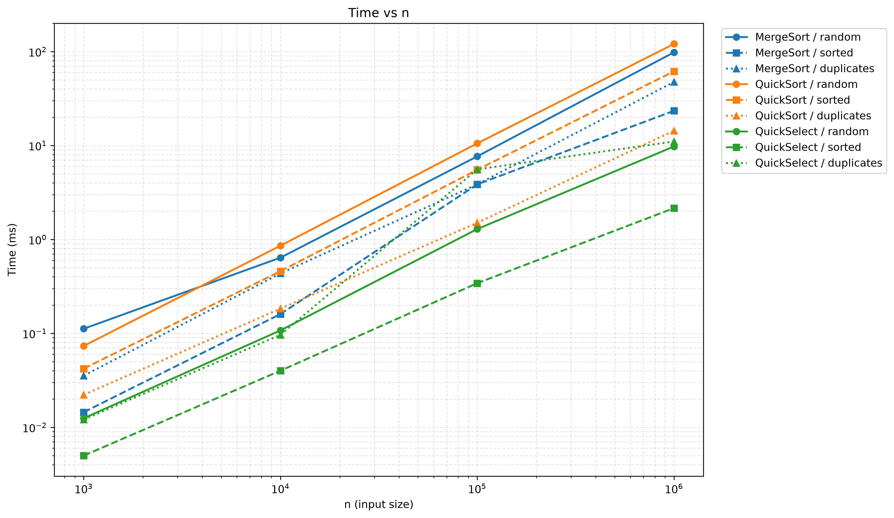
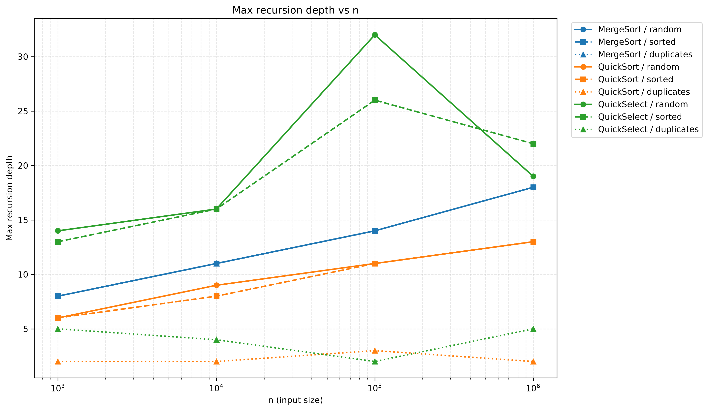
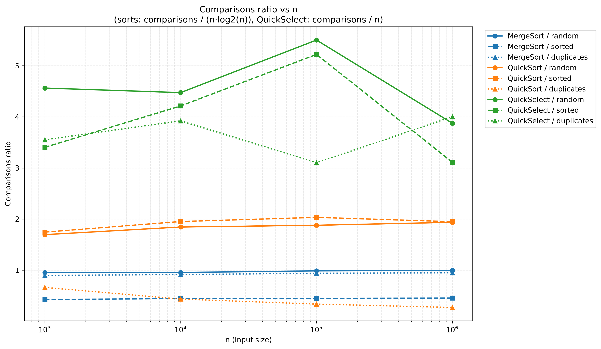

# DAA Assignment 1 Report

**Student:** Akmaral Zhumabay  
**Group:** SE-2517

## 1. Asymptotic Bounds

| Algorithm | Best Case | Average Case | Worst Case |
|---|---|---|---|
| MergeSort | Θ(n log n) — the array is still recursively divided and merged even when it is already sorted. | Θ(n log n) — all levels of recursion process the elements during merging. | Θ(n log n) — an unfavorable order does not change the number of recursive levels and linear merging work. |
| QuickSort | Θ(n log n) — pivots repeatedly divide the array into balanced parts. | Θ(n log n) — randomized pivots give reasonably balanced partitions on average. | O(n²) — extremely unbalanced partitions can occur if the pivot repeatedly becomes an extreme value. |
| QuickSelect | Ω(n) — partitioning itself examines the current range, even when the pivot quickly locates `k`. | Θ(n) — randomized partitioning reduces the remaining search range sufficiently on average. | O(n²) — repeatedly choosing an extreme pivot can leave a subproblem only one element smaller each time. |
| Insertion Sort | Θ(n) — an already sorted array requires approximately one comparison per element. | Θ(n²) — a typical unsorted array requires many shifts and comparisons. | Θ(n²) — a reverse-sorted array makes each new element move through the entire sorted prefix. |

MergeSort therefore has the same asymptotic order in its best, average, and worst cases. Randomized QuickSort has expected Θ(n log n) performance but still has an O(n²) theoretical worst case. QuickSelect has expected linear performance because it continues into only one partition.

## 2. Recurrences

### MergeSort

For MergeSort, the array is divided into two halves and both halves are recursively sorted. Merging the two sorted halves requires linear work.

```text
T(n) = 2T(n/2) + Θ(n)
```

Therefore:

```text
a = 2
b = 2
f(n) = Θ(n)
```

We calculate:

```text
n^(log_b(a)) = n^(log_2(2)) = n
```

Since:

```text
f(n) = Θ(n)
```

this is **Master Theorem Case 2**.

Therefore:

```text
T(n) = Θ(n log n)
```

The insertion-sort cutoff changes the work for small subarrays but does not change the overall asymptotic complexity.

### QuickSort

For the balanced case, QuickSort divides the array into two approximately equal parts. Partitioning requires linear work.

```text
T(n) = 2T(n/2) + Θ(n)
```

Therefore:

```text
a = 2
b = 2
f(n) = Θ(n)
```

Again:

```text
n^(log_b(a)) = n
```

This is **Master Theorem Case 2**, so:

```text
T(n) = Θ(n log n)
```

The implementation chooses the pivot randomly. Because the pivot is independent of the original input order, an already sorted array does not automatically produce the worst case. Over many partitions, randomized pivots give sufficiently balanced splits on average, which gives expected **O(n log n)** running time, although an unlucky sequence of pivots can still produce O(n²).

### QuickSelect

QuickSelect is different from QuickSort because only one side of the partition is processed after each partition operation.

For a balanced split:

```text
T(n) = T(n/2) + Θ(n)
```

Therefore:

```text
a = 1
b = 2
f(n) = Θ(n)
```

We calculate:

```text
n^(log_b(a)) = n^(log_2(1)) = 1
```

Here `f(n) = Θ(n)` is polynomially larger than `n^(log_b(a)) = 1`.

This is **Master Theorem Case 3**.

Therefore:

```text
T(n) = Θ(n)
```

Randomized QuickSelect has expected Θ(n) running time, although its theoretical worst case is O(n²).

## 3. Benchmark Method

The benchmark uses four required input sizes:

```text
1,000
10,000
100,000
1,000,000
```

For each size, three input types are tested:

- `random` — random integer values
- `sorted` — an already sorted array
- `duplicates` — values with many duplicates

Each algorithm/input/size combination is executed five times. The measured runs are compared and the median-time result is stored in `results.csv`.

The CSV contains:

```text
algorithm,input,n,time_ms,comparisons,max_depth
```

The benchmark records execution time, number of comparisons, and maximum recursion depth.

## 4. Plots

The benchmark results are visualized using three plots.

### Time vs n



This plot shows how execution time changes as the input size increases. Each algorithm and input type has its own line.

### Maximum Recursion Depth vs n



This plot shows the maximum recursion depth for each algorithm and input type. QuickSort uses smaller-side recursion, which keeps its actual recursive stack depth small.

### Ratio vs n



For MergeSort and QuickSort, the plotted ratio is:

```text
comparisons / (n * log2(n))
```

For QuickSelect, the ratio is:

```text
comparisons / n
```

If the ratio becomes approximately constant for large values of `n`, the measurements support the expected Θ growth.

## 5. Θ Check

The ratio plot can be used to compare the measured number of comparisons with the expected growth function.

For MergeSort and QuickSort:

```text
g(n) = n log2(n)
```

For QuickSelect:

```text
g(n) = n
```

Using the larger measured inputs, the ratios become approximately stable. Reasonable empirical constants from the benchmark are:

| Case | g(n) | Approximate Ratio Range | c1 | c2 | n0 |
|---|---|---:|---:|---:|---:|
| MergeSort random | n log2(n) | 0.987–0.998 | 0.98 | 1.01 | 100,000 |
| MergeSort sorted | n log2(n) | 0.448–0.455 | 0.44 | 0.46 | 100,000 |
| MergeSort duplicates | n log2(n) | 0.940–0.950 | 0.93 | 0.96 | 100,000 |
| QuickSort random | n log2(n) | 1.237–1.259 | 1.22 | 1.28 | 100,000 |
| QuickSort sorted | n log2(n) | 1.261–1.274 | 1.24 | 1.29 | 100,000 |
| QuickSelect random | n | 3.175–3.721 | 3.0 | 3.9 | 100,000 |
| QuickSelect sorted | n | 3.499–4.028 | 3.3 | 4.2 | 100,000 |
| QuickSelect duplicates | n | 2.501–2.903 | 2.4 | 3.0 | 100,000 |

For example, for MergeSort on random input and `n ≥ 100,000`, the measurements approximately satisfy:

```text
0.98 · n log2(n) ≤ comparisons ≤ 1.01 · n log2(n)
```

The ratios for the larger inputs remain inside a relatively small range, so the experimental results support the expected Θ bounds. These values are empirical constants from the benchmark rather than universal mathematical constants. Randomized algorithms such as QuickSort and QuickSelect can produce slightly different values on another run.

## 6. Discussion

The measurements generally match the theoretical complexity of the algorithms. MergeSort grows close to Θ(n log n), which is visible from the nearly stable comparison ratio for larger inputs. QuickSort also shows behavior close to n log n for random and sorted inputs because the pivot is selected randomly. QuickSelect grows approximately linearly because it continues into only one partition instead of recursively processing both sides. The measured execution times are not perfectly smooth because real execution time depends on more than asymptotic complexity. JVM warm-up can make early executions slower while Java compiles frequently used code. Garbage Collection can temporarily interrupt a benchmark and increase the measured time of some runs. CPU cache behavior also affects performance because accessing data already stored in a fast cache is cheaper than accessing data from main memory. Finally, the insertion-sort cutoff of 15 improves MergeSort performance on small subarrays by avoiding unnecessary recursive calls, but it does not change the overall Θ(n log n) complexity.